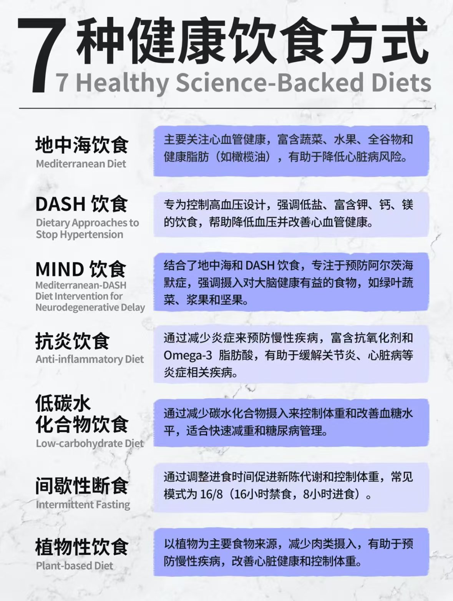
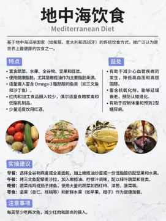
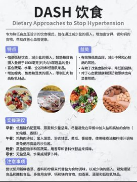
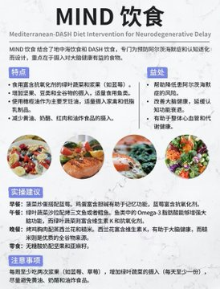
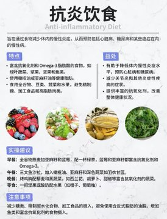
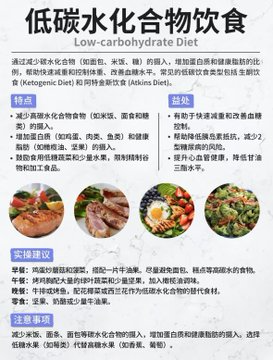
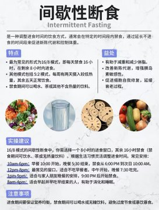
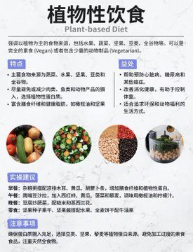

# 七种健康饮食

- 七种健康饮食的概述
    
    
    
- 七种健康饮食方式详细介绍
    - 地中海饮食
        
        
        
    - DASH 饮食
        
        
        
    - MIND 饮食
        
        
        
    - 抗炎饮食
        
        
        
    - 低碳水化合物饮食
        
        
        
    - 间歇性断食
        
        
        
    - 植物性饮食
        
        
